# jabberpoint-gerefactored

Verbeterde versie van Jabberpoint (door Sydney Minnaar - 4753046)

## Class-diagrams

Hieronder zijn op een chronologische volgorde de class-diagrams respectievelijk vooraf, na het publiceren van de app, en de verbeterde versie in kaart gebracht.

### Initiële versie

.svg)

### Versie na code publicatie

.svg)

### Verbeterde versie

.svg)

## Usecase-diagram

Hieronder wordt de usecase-diagram op basis van de applicatie getoond.

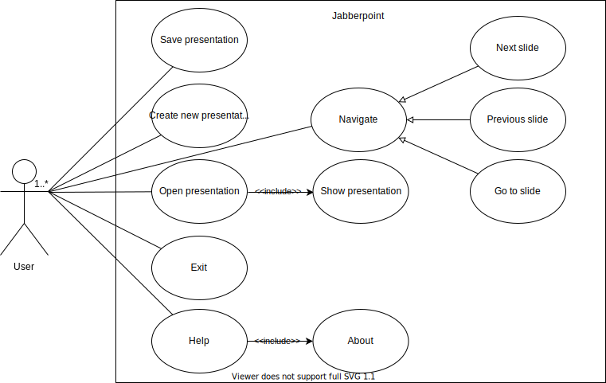

## Component-diagram

Hieronder is een component-diagram in kaart gebracht, op basis van de verbeterde class diagram.

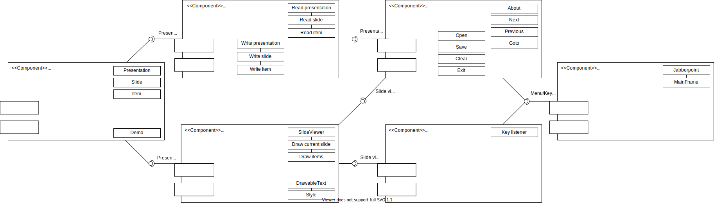

## Activity-diagrams

Hieronder worden de activity-diagrams getoond, op basis van de functionaliteiten die de gebruiker kan uitvoeren.

### About Jabberpoint

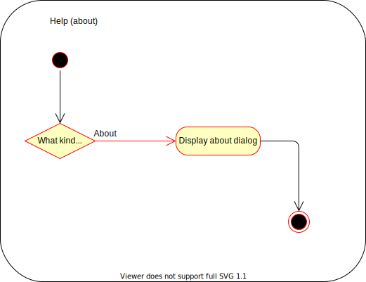

### Exit Jabberpoint

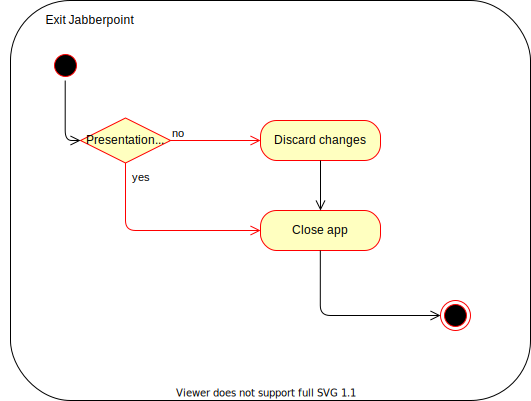

### Navigate slides

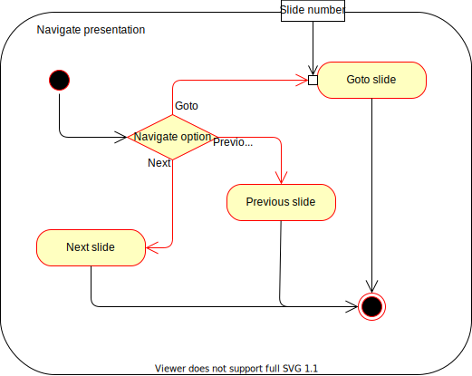

### New presentation

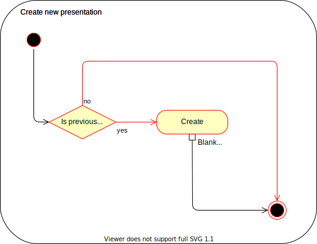

### Open presentation

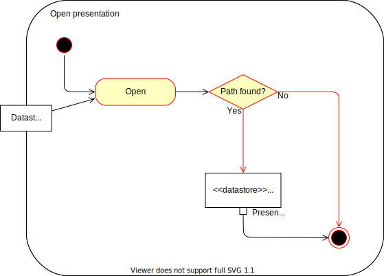

### Save presentation

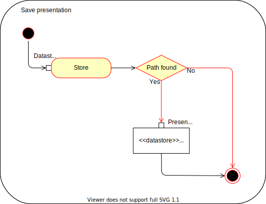

### Show presentation

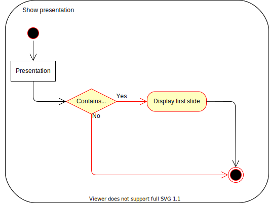

## Sequence-diagrams

Hieronder zijn de sequence-diagrams in kaart gebracht, op basis van de functionaliteiten die de gebruiker kan uitvoeren.

### About Jabberpoint

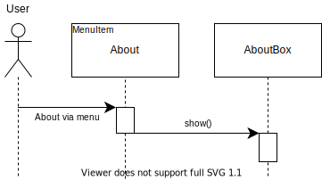

### Clear presentation (new)

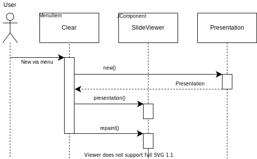

### Exit Jabberpoint

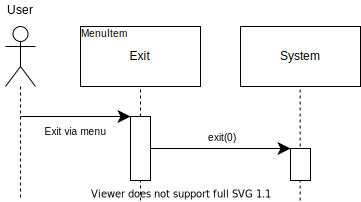

### Goto slide

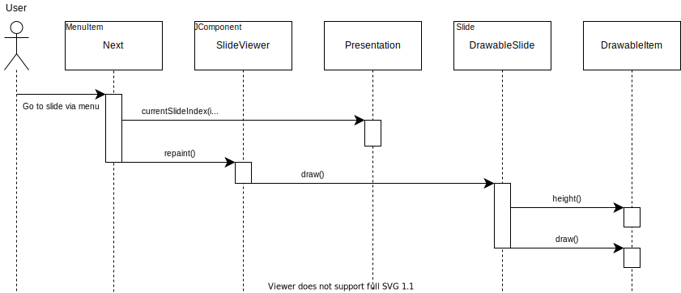

### Next slide

### Previous slide

### Open presentation

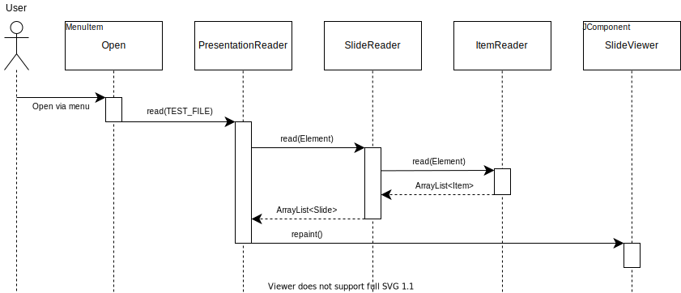

### Save presentation

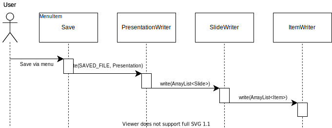

## State-machine diagrams

Hieronder worden de state-machine diagrams getoond, op basis van de functionaliteiten die de gebruiker kan uitvoeren.

### Presentation state

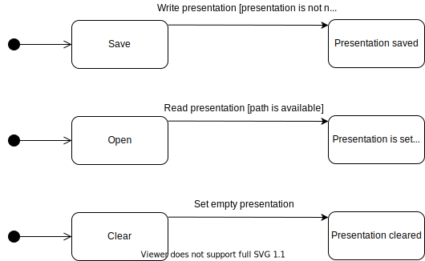

### Slide state

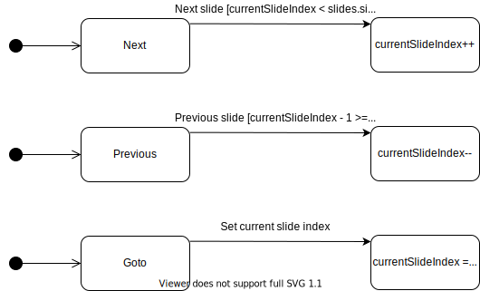
